## Implementation Status

### ✅ COMPLETED

**Phase 1: Population Infrastructure** - PR #5 (Merged)
- ✅ `PopulationEstimates`, `PopulationPriors`, `Population` structs
- ✅ 6 MCMC samplers (3 Gibbs, 3 MH) for population parameters
- ✅ 57 unit tests with 290 base tests passing
- ✅ All CI builds passing

**Phase 2: Population MCMC Orchestration** - PR #6 (Ready for Merge)
- ✅ `pop_mcmc_iteration.h` - Two-stage MCMC orchestration
- ✅ `population.cpp` - Rcpp export function
- ✅ `populationchains.h` - Three-level hierarchical output
- ✅ Fixed duplicate symbol linker errors (21 methods marked inline)
- ✅ All CI builds passing (macOS 7m54s, Ubuntu 18m16s)

**Phase 3: Joint Hormone Model** - PR #8 (Ready for Merge)
- ✅ `AssociationEstimates`, `AssociationPriors` structs
- ✅ `joint_birthdeath.h` - Coupled birth-death process (313 lines)
- ✅ `joint_draw_association.h` - MH samplers for ρ and ν (265 lines)
- ✅ `joint_update_lambda.h` - Lambda recalculation functions
- ✅ `joint_mcmc_iteration.h` - Full MCMC orchestration (246 lines)
- ✅ `jointsinglesubject.cpp` - Rcpp export function (237 lines)
- ✅ Fixed compilation errors (PatientEstimates/PatientPriors construction)
- ✅ Fixed const-correctness in PulseEstimates methods
- ✅ Fixed lambda update bug after response pulse location changes
- ✅ 49 unit tests in 6 test cases
- ✅ All CI builds passing (macOS 7m31s, Ubuntu 17m48s)

### ✅ COMPLETED (Phase 2 Production Features)

**Core R Interface** - Implemented 12/31/2025
- ✅ `population_spec()` - Specification function for priors and parameters
- ✅ `fit_pulse_population()` - Main fitting function with comprehensive validation
- ✅ Integration tests with simulated multi-subject data (16 test cases)
- ✅ Print and summary methods for `population_fit` objects
- ✅ Support for both list-of-dataframes and single-dataframe-with-subject-id input formats
- ✅ Automatic subject starting value initialization
- ✅ All tests passing

### 🔲 OUTSTANDING

**Phase 2 Enhanced Features** - Not Started
- ❌ Vignettes with worked examples
- ❌ Comparison with reference C implementation
- ❌ Performance benchmarking
- ❌ Convergence diagnostics (Gelman-Rubin, ESS)
- ❌ Progress bar for long MCMC runs
- ❌ Checkpoint/resume capability
- ❌ Runtime and default parameter documentation

**Phase 4: Combined Population + Joint Model** - Not Started
- ❌ Population-level association parameters (ρ, ν shared across subjects)
- ❌ Multi-subject joint model MCMC orchestration
- ❌ `fit_pulse_population_joint()` R interface
- ❌ Combined model testing and validation

### 🐛 Known Issues

**Non-Blocking Warnings** (Present in all PRs):
- Non-virtual destructor warnings in sampler classes (15-16 warnings per build)
- Does not affect functionality or correctness

### 📊 Test Coverage

- **C++ Unit Tests**: 396 total assertions
  - Base: 290 tests
  - Phase 1: 57 tests
  - Phase 3: 49 tests
- **All tests passing** ✅

---

## Summary

I've completed a comprehensive assessment of `libpulsatile`. Here are the key findings:

### Current State of Single-Subject Model ✅

The single-subject model is **fully functional** with:

- Well-organized C++ backend using Rcpp/RcppArmadillo
- Clean separation of data structures (`Patient`, `PatientData`, `PatientEstimates`, `PatientPriors`, `PulseEstimates`)
- Template-based Metropolis-Hastings samplers for flexibility
- Birth-death process for pulse number inference (Strauss prior)
- R interface via `fit_pulse()`, `pulse_spec()`, `simulate_pulse()`

### Reference C Code Available

Two reference implementations exist in the project:

1. **Population Model** (`PopModelCode-LiuPaper/`) - Adds hierarchical structure with:

- Population-level means (μ_α, μ_ω, θ_b, θ_h)
- Subject-to-subject variation (υ_α, υ_ω, σ_b, σ_h)
- Shared pulse-to-pulse variation (σ_α, σ_ω)

1. **Joint Hormone Model** (`JointModelCode_LiuPaper/`) - Models driver/response coupling:

- Driver hormone (e.g., LH) triggers response hormone (e.g., FSH) pulses
- Coupling via kernel function with parameters ρ (size) and ν (width)
- λ coupling intensity field on response pulses

### Implementation Plan

The plan is organized in 4 phases:

|Phase|Focus                    |Status      |Key Deliverables                                                                   |
|-----|-------------------------|------------|-----------------------------------------------------------------------------------|
|**1**|Population infrastructure|✅ COMPLETE|`Population`, `PopulationEstimates`, `PopulationPriors` structs + Gibbs/MH samplers|
|**2**|Population MCMC          |✅ COMPLETE|Orchestration loop, R interface `fit_pulse_population()`                           |
|**3**|Joint hormone model      |✅ COMPLETE|λ update mechanism, modified birth-death, ρ/ν samplers                             |
|**4**|Combined model           |❌ PENDING |Population + Joint hormones together                                               |

### Key Reuse Opportunities

Many single-subject components can be directly reused:

- Birth-death process (loop over subjects)
- Pulse-level samplers (mass, width, location, t-variance scales)
- Likelihood calculations
- Proposal variance adaptation

The main new code needed is:

1. Population-level samplers (Gibbs for means, MH for SDs)
1. Orchestration loop iterating over subjects
1. Lambda update mechanism for joint model
1. R interface functions

The detailed implementation plan document includes specific struct definitions, sampler templates, and a testing strategy.

# libpulsatile: Assessment and Implementation Plan

## Executive Summary

The `libpulsatile` package is a C++ backend with R frontend for Bayesian deconvolution analysis of pulsatile hormone data. Currently, only the **single-subject model** is functional. This document assesses the current state and outlines a plan to implement:

1. **Population Model** - Multiple subjects with hierarchical parameters
1. **Joint Hormone Model** - Driver/trigger hormone affecting a response hormone

-----

## 1. Current State Assessment

### 1.1 Project Architecture

```
libpulsatile/
├── include/
│   ├── bp_datastructures/    # Core data structures
│   │   ├── patient.h          # Patient struct (data, estimates, pulses)
│   │   ├── patientdata.h      # Observed time/concentration data
│   │   ├── patientestimates.h # MCMC parameter estimates
│   │   ├── patientpriors.h    # Prior distributions
│   │   ├── pulseestimates.h   # Individual pulse parameters
│   │   └── chains.h           # MCMC output storage
│   ├── bp_mcmc/              # MCMC algorithms
│   │   ├── mh.h               # Template Metropolis-Hastings class
│   │   ├── proposalvariance.h # Adaptive proposal variance
│   │   └── utils.h            # Utility functions
│   └── bpmod_singlesubject/  # Single-subject model components
│       ├── bpmod_singlesubject.h  # Main header
│       ├── birthdeath.h       # Birth-death process for pulses
│       ├── ss_draw_*.h        # Individual parameter samplers
│       └── ...
├── R-package/                # R interface
│   ├── src/
│   │   └── singlesubject.cpp  # Rcpp export function
│   └── R/
│       ├── fit.R              # fit_pulse() main function
│       ├── spec.R             # pulse_spec() prior specification
│       └── simulate.R         # Simulation functions
├── PopModelCode-LiuPaper/    # Reference C code for population model
│   └── src/*.c
└── JointModelCode_LiuPaper/  # Reference C code for joint hormone model
    └── src/*.c
```

### 1.2 Single-Subject Model (✅ Functional)

**Key Components:**

|Component          |Location            |Description                                                  |
|-------------------|--------------------|-------------------------------------------------------------|
|`PatientData`      |`patientdata.h`     |Stores time, concentration vectors, fit bounds               |
|`PatientEstimates` |`patientestimates.h`|Baseline, half-life, error variance, mass/width means and SDs|
|`PatientPriors`    |`patientpriors.h`   |Prior distributions for all parameters                       |
|`PulseEstimates`   |`pulseestimates.h`  |Per-pulse: location, mass, width, t-variance scales          |
|`Patient`          |`patient.h`         |Container: data + estimates + priors + pulse list            |
|`BirthDeathProcess`|`birthdeath.h`      |Samples number of pulses using Strauss process               |

**MCMC Samplers (all in `include/bpmod_singlesubject/`):**

- `ss_draw_baselinehalflife.h` - Joint baseline/half-life MH sampler
- `ss_draw_fixedeffects.h` - Mean mass/width MH samplers
- `ss_draw_sd_randomeffects.h` - SD of mass/width MH samplers
- `ss_draw_randomeffects.h` - Individual pulse mass/width MH samplers
- `ss_draw_tvarscale.h` - T-distribution variance scale samplers
- `ss_draw_error.h` - Model error variance Gibbs sampler
- `ss_draw_locations.h` - Pulse location MH sampler

**R Interface:**

- `fit_pulse()` - Main fitting function
- `pulse_spec()` - Specify priors, starting values, proposal variances
- `simulate_pulse()` - Generate simulated data

### 1.3 Reference C Code Analysis

#### Population Model (`PopModelCode-LiuPaper/`)

**Hierarchical Structure:**

```
Population Level (estimated)
├── μ_α (mean of mean pulse masses)
├── μ_ω (mean of mean pulse widths)
├── σ_α (pulse-to-pulse SD of mass)
├── σ_ω (pulse-to-pulse SD of width)
├── υ_α (subject-to-subject SD of mean mass)
├── υ_ω (subject-to-subject SD of mean width)
├── θ_b (population mean baseline)
├── θ_h (population mean half-life)
├── σ_b (subject-to-subject SD of baseline)
├── σ_h (subject-to-subject SD of half-life)
└── σ²_e (model error variance)

Subject Level (N_s subjects, estimated)
├── μ_α,s (subject mean pulse mass)
├── μ_ω,s (subject mean pulse width)
├── θ_b,s (subject baseline)
└── θ_h,s (subject half-life)

Pulse Level (N_k pulses per subject, estimated)
├── α_k (pulse mass)
├── ω_k (pulse width)
├── τ_k (pulse location)
├── κ_α,k (t-distribution scale for mass)
└── κ_ω,k (t-distribution scale for width)
```

**Key C Structures:**

```c
// Subject-level structure (from pop_deconvolution_main.h)
typedef struct subject_tag {
    struct subject_tag *succ;   // Next subject
    struct subject_tag *pred;   // Previous subject
    Node_type *list;            // Pulse linked list
    double basehalf[2];         // Subject baseline, half-life
    double theta[2];            // Subject mean mass, mean width
    char *common;               // Output file for common params
    char *pulse;                // Output file for pulse params
    FILE *csub;
    FILE *psub;
} Subject_type;

// Population-level priors
typedef struct {
    double fe_mean[2];          // Prior mean for mass/width means
    double fe_precision[2];     // Prior variance for mass/width means
    double *re_precision;       // Subject-to-subject variance
    double meanbh[2];           // Prior mean for baseline/half-life
    double varbh[2];            // Prior variance for baseline/half-life
    // ...
} Priors;
```

#### Joint Hormone Model (`JointModelCode_LiuPaper/`)

**Coupling Mechanism:**
The driver hormone’s pulses influence the response hormone through a kernel function:

```
λ_k(t) = Σ_j [ρ / √(2πν)] × exp(-(t - τ_j)² / 2ν)
```

Where:

- `ρ` (rho) = cluster size parameter (driver effect strength)
- `ν` (nu) = cluster width parameter (temporal spread of effect)
- `τ_j` = driver pulse locations

**Key C Structures:**

```c
// Subject with both hormones (from jt_deconvolution_main.h)
typedef struct subject_tag {
    Node_type *driver;      // Driver hormone pulses (e.g., LH)
    Node_type *response;    // Response hormone pulses (e.g., FSH)
    double theta_f[2];      // Response mean mass, width
    double theta_l[2];      // Driver mean mass, width
    double basehalf_f[2];   // Response baseline, half-life
    double basehalf_l[2];   // Driver baseline, half-life
    // ... file handles etc
} Subject_type;

// Response pulse node includes lambda (coupling intensity)
typedef struct node_tag {
    double time;
    double theta[2];        // mass, width
    double *mean_contrib;
    double eta[2];          // t-dist scales
    double lambda;          // Coupling intensity from driver
} Node_type;
```

-----

## 2. Implementation Plan

### 2.1 Phase 1: Population Model Infrastructure

**Goal:** Create data structures and basic sampling framework for multiple subjects.

#### 2.1.1 New Data Structures

**`Population` struct** (`include/bp_datastructures/population.h`):

```cpp
struct PopulationEstimates {
    // Population means
    double mass_mean;        // μ_α
    double width_mean;       // μ_ω
    double baseline_mean;    // θ_b
    double halflife_mean;    // θ_h
    
    // Subject-to-subject SDs
    double mass_mean_sd;     // υ_α
    double width_mean_sd;    // υ_ω
    double baseline_sd;      // σ_b
    double halflife_sd;      // σ_h
    
    // Pulse-to-pulse SDs (shared across subjects)
    double mass_sd;          // σ_α
    double width_sd;         // σ_ω
    
    // Error variance
    double errorsq;          // σ²_e
};

struct PopulationPriors {
    // Priors on population means
    double mass_mean_mean, mass_mean_var;
    double width_mean_mean, width_mean_var;
    double baseline_mean_mean, baseline_mean_var;
    double halflife_mean_mean, halflife_mean_var;
    
    // Priors on subject-to-subject SDs (uniform upper bounds)
    double mass_mean_sd_max;
    double width_mean_sd_max;
    double baseline_sd_max;
    double halflife_sd_max;
    
    // Priors on pulse-to-pulse SDs (uniform upper bounds)
    double mass_sd_max;
    double width_sd_max;
    
    // Error prior (inverse-gamma)
    double error_alpha, error_beta;
    
    // Pulse count prior (Poisson)
    double pulse_count_prior;
};

struct Population {
    std::vector<Patient> subjects;
    PopulationEstimates estimates;
    PopulationPriors priors;
    int num_subjects;
    
    // Methods
    double get_total_observations();
    double get_total_pulses();
    arma::vec get_all_subject_baselines();
    // etc.
};
```

#### 2.1.2 Modified Existing Structures

**`PatientEstimates` for Population** (already partially implemented):

```cpp
// Population version: mass_sd and width_sd come from population level
PatientEstimates(double sv_baseline,
                 double sv_halflife,
                 double sv_errorsq,    // Could be removed for pop model
                 double sv_mass_mean,
                 double sv_width_mean)
```

**`PatientPriors` for Population** (already has constructor):

```cpp
// Population: priors come from population estimates, not user-specified
PatientPriors(double prior_baseline_mean,    // From PopulationEstimates
              double prior_baseline_variance, // From PopulationEstimates  
              // ...
              double prior_mass_mean_sd,      // From PopulationEstimates
              double prior_width_mean_sd)     // From PopulationEstimates
```

#### 2.1.3 New MCMC Samplers

Create new directory: `include/bpmod_population/`

|Sampler                             |Description                    |Type |
|------------------------------------|-------------------------------|-----|
|`pop_draw_means.h`                  |μ_α, μ_ω population means      |Gibbs|
|`pop_draw_mean_sds.h`               |υ_α, υ_ω subject-to-subject SDs|MH   |
|`pop_draw_pulse_sds.h`              |σ_α, σ_ω pulse-to-pulse SDs    |MH   |
|`pop_draw_baseline_halflife_means.h`|θ_b, θ_h population means      |Gibbs|
|`pop_draw_baseline_halflife_sds.h`  |σ_b, σ_h subject SDs           |MH   |
|`pop_draw_error.h`                  |σ²_e error variance            |Gibbs|

Most subject-level and pulse-level samplers can **reuse** the single-subject versions with slight modifications to pull priors from `PopulationEstimates` instead of `PatientPriors`.

#### 2.1.4 Chains Extension

Extend `Chains` class to handle population output:

```cpp
class PopulationChains : public Chains {
    arma::mat population_chain;  // Population-level parameters
    std::vector<arma::mat> subject_chains;  // Per-subject parameters
    std::vector<MatrixVector> pulse_chains; // Per-subject pulse parameters
};
```

### 2.2 Phase 2: Population Model MCMC Loop

**New file:** `include/bpmod_population/bpmod_population.h`

```cpp
void population_mcmc_iteration(Population& pop, int iter) {
    // 1. Birth-death for each subject
    for (Patient& subj : pop.subjects) {
        birth_death.sample(&subj, false, iter);
    }
    
    // 2. Subject-level parameters (conditioned on population)
    for (Patient& subj : pop.subjects) {
        draw_baseline_halflife(&subj, &pop, iter);
        draw_subject_mass_mean(&subj, &pop, iter);
        draw_subject_width_mean(&subj, &pop, iter);
        
        // Pulse-level
        for (PulseIter p = subj.pulses.begin(); ...) {
            draw_pulse_mass(&subj, p, &pop, iter);
            draw_pulse_width(&subj, p, &pop, iter);
            draw_pulse_location(&subj, p, iter);
            draw_tvarscale_mass(&subj, p, iter);
            draw_tvarscale_width(&subj, p, iter);
        }
    }
    
    // 3. Population-level parameters
    draw_population_mass_mean(pop, iter);
    draw_population_width_mean(pop, iter);
    draw_population_mass_mean_sd(pop, iter);
    draw_population_width_mean_sd(pop, iter);
    draw_population_mass_sd(pop, iter);
    draw_population_width_sd(pop, iter);
    draw_population_baseline_mean(pop, iter);
    draw_population_halflife_mean(pop, iter);
    draw_population_baseline_sd(pop, iter);
    draw_population_halflife_sd(pop, iter);
    draw_population_error(pop, iter);
}
```

**New Rcpp export:** `R-package/src/population.cpp`

```cpp
// [[Rcpp::export]]
Rcpp::List population_(Rcpp::List data_list,    // List of subject data
                       Rcpp::List inpriors,
                       Rcpp::List proposalvars,
                       Rcpp::List startingvals,
                       int mcmc_iterations,
                       // ... other args
                       )
```

### 2.3 Phase 3: Joint Hormone Model

**Goal:** Model two hormones where the driver affects the response.

#### 2.3.1 Extended Data Structures

**`PatientData` extension:**

```cpp
struct PatientData {
    // Existing
    arma::vec time;
    arma::vec concentration;
    
    // For joint model
    arma::vec response_concentration;  // Already exists!
    bool has_response;
};
```

**`JointModelParameters`:**

```cpp
struct AssociationParameters {
    double rho;     // Cluster size (log scale for sampling)
    double nu;      // Cluster width (log scale for sampling)
    
    // Priors
    double rho_mean, rho_var;
    double nu_mean, nu_var;
};
```

**`PulseEstimates` extension:**

```cpp
struct PulseEstimates {
    // Existing fields...
    
    // For response hormone pulses
    double lambda;  // Coupling intensity from driver hormone
};
```

#### 2.3.2 New MCMC Components

Create: `include/bpmod_joint/`

|Component              |Description                                       |
|-----------------------|--------------------------------------------------|
|`joint_birthdeath.h`   |Birth-death for response considering driver pulses|
|`joint_draw_rho.h`     |Sample cluster size parameter                     |
|`joint_draw_nu.h`      |Sample cluster width parameter                    |
|`joint_update_lambda.h`|Update coupling intensities after driver changes  |

**Key algorithm:** When a driver pulse is born/dies or moves, update all response pulse λ values:

```cpp
void update_lambda(Patient& patient, Common_parms& parms) {
    for (auto& response_pulse : patient.responses) {
        response_pulse.lambda = 0.0;
        for (auto& driver_pulse : patient.pulses) {
            double k = exp(-pow(response_pulse.location - driver_pulse.location, 2) 
                          / (2 * parms.nu));
            response_pulse.lambda += parms.rho / sqrt(2 * M_PI * parms.nu) * k;
        }
    }
}
```

### 2.4 Phase 4: Combined Population + Joint Model

The ultimate goal is a population model with two hormones. This combines:

- Multiple subjects (Phase 2)
- Driver/response relationship (Phase 3)
- Population-level association parameters (ρ, ν shared across subjects)

-----

## 3. Implementation Priority and Timeline

### Recommended Order:

|Phase|Component                                        |Effort|Priority|Status      |
|-----|-------------------------------------------------|------|--------|------------|
|1a   |`PopulationEstimates`, `PopulationPriors` structs|Low   |High    |✅ COMPLETE|
|1b   |`Population` struct with subject vector          |Low   |High    |✅ COMPLETE|
|1c   |Population Gibbs samplers (means)                |Medium|High    |✅ COMPLETE|
|1d   |Population MH samplers (SDs)                     |Medium|High    |✅ COMPLETE|
|2a   |Population MCMC loop                             |Medium|High    |✅ COMPLETE|
|2b   |R interface for population                       |Medium|High    |✅ COMPLETE|
|2c   |Population chains output                         |Medium|Medium  |✅ COMPLETE|
|3a   |Joint model data structures                      |Low   |Medium  |✅ COMPLETE|
|3b   |Lambda update mechanism                          |Medium|Medium  |✅ COMPLETE|
|3c   |Joint birth-death process                        |High  |Medium  |✅ COMPLETE|
|3d   |ρ, ν samplers                                    |Medium|Medium  |✅ COMPLETE|
|4    |Combined population + joint                      |High  |Low     |❌ PENDING |

### Milestones:

1. **✅ Milestone 1** (Population Infrastructure): Phases 1a-1d complete
   - Can create Population objects with multiple patients
   - All sampler classes defined
   - **Status**: PR #5 merged

2. **✅ Milestone 2** (Population Model Working): Phases 2a-2c complete
   - `fit_pulse_population()` function works
   - Can run MCMC on multi-subject data
   - **Status**: PR #6 ready for merge (all CI passing)

3. **✅ Milestone 3** (Joint Model Working): Phases 3a-3d complete
   - Joint model works for single subject with two hormones
   - Driver/response coupling functional
   - **Status**: PR #8 ready for merge (all CI passing)

4. **❌ Milestone 4** (Full Model): Phase 4 pending
   - Population model with joint hormones
   - Complete feature parity with legacy C code
   - **Status**: Not started

-----

## 4. Testing Strategy

### Unit Tests (C++, using Catch framework)

```cpp
// tests/test_population.cpp
TEST_CASE("Population initialization") {
    // Test creating population from multiple patients
}

TEST_CASE("Population Gibbs samplers") {
    // Test population mean updates with known values
}

TEST_CASE("Lambda calculation") {
    // Test coupling intensity calculation
}
```

### Integration Tests (R, using testthat)

```r
# R-package/tests/testthat/test_population.R
test_that("fit_pulse_population runs without error", {
    sim_data <- simulate_population(n_subjects = 5)
    spec <- population_spec()
    fit <- fit_pulse_population(sim_data, spec, iters = 1000)
    expect_s3_class(fit, "bp_population_fit")
})

test_that("population posteriors recover true values", {
    # Simulation study with known parameters
})
```

-----

## 5. Key Code Reuse Opportunities

Many single-subject components can be reused with minimal modification:

|Component                   |Reuse Strategy                      |
|----------------------------|------------------------------------|
|Birth-death process         |Same algorithm, loop over subjects  |
|Pulse mass/width samplers   |Template with different prior source|
|Location sampler            |Direct reuse                        |
|T-variance scale sampler    |Direct reuse                        |
|Likelihood calculation      |Direct reuse per subject            |
|Proposal variance adaptation|Direct reuse                        |

The main new code needed is:

1. Population-level samplers (Gibbs for means, MH for SDs)
1. Orchestration loop iterating over subjects
1. Lambda update mechanism for joint model
1. R interface functions

-----

## 6. Current Status and Next Steps

### Completed (2025)

1. ✅ **Reviewed plan** with domain experts
2. ✅ **Implemented Phase 1** (PR #5) - Population infrastructure with data structures and samplers
3. ✅ **Implemented Phase 2** (PR #6) - Population MCMC orchestration and R interface
4. ✅ **Implemented Phase 3** (PR #8) - Joint hormone model with driver-response coupling
5. ✅ **Fixed critical bugs**:
   - Duplicate symbol linker errors (added `inline` to 21 methods)
   - Lambda update bug after response pulse location changes
   - Compilation errors in joint model Rcpp interface
6. ✅ **Comprehensive testing**:
   - 396 C++ unit test assertions
   - All CI builds passing on macOS and Ubuntu
   - Code coverage validation

### Ready for Deployment

**PR #6** (Phase 2: Population Model)
- All tests passing
- Code reviewed
- Ready to merge

**PR #8** (Phase 3: Joint Model)
- All tests passing
- Code reviewed
- Lambda bug fixed
- Ready to merge

### Future Work (Phase 4)

**Combined Population + Joint Model** - Not yet started

This would require:
1. Multi-subject data structures for joint model
2. Population-level association parameters (ρ, ν shared across subjects)
3. Orchestration loop combining population hierarchy with joint coupling
4. R interface: `fit_pulse_population_joint()`
5. Validation against reference C code in `JointModelCode_LiuPaper/`

**Estimated effort**: High (similar scope to Phase 2 + Phase 3 combined)


# Model Hierarchy Diagram

```mermaid
%%{init: {'theme': 'base', 'themeVariables': { 'fontSize': '14px'}}}%%
flowchart TB
    subgraph Single["<b>Single-Subject Model</b> (Currently Implemented)"]
        direction TB
        SS_Priors["<b>User-Specified Priors</b><br/>baseline_mean, baseline_var<br/>halflife_mean, halflife_var<br/>mass_mean, mass_var<br/>width_mean, width_var<br/>mass_sd_param, width_sd_param<br/>error_alpha, error_beta"]
        SS_Patient["<b>Patient Estimates</b><br/>(MCMC Updated)<br/>baseline, halflife<br/>mass_mean, width_mean<br/>mass_sd, width_sd<br/>error_variance"]
        SS_Pulses["<b>Pulse Estimates</b><br/>(N pulses per iteration)<br/>location_k, mass_k, width_k<br/>tvarscale_mass_k<br/>tvarscale_width_k"]
        
        SS_Priors --> SS_Patient
        SS_Patient --> SS_Pulses
    end

    subgraph Pop["<b>Population Model</b> (To Be Implemented)"]
        direction TB
        Pop_Priors["<b>User-Specified Priors</b><br/>mass_mean_mean, mass_mean_var<br/>width_mean_mean, width_mean_var<br/>baseline_mean, baseline_var<br/>halflife_mean, halflife_var<br/>SD_max values (uniform)<br/>error_alpha, error_beta"]
        Pop_Est["<b>Population Estimates</b><br/>(MCMC Updated)<br/>μ_α (mean mass mean)<br/>μ_ω (mean width mean)<br/>θ_b (mean baseline)<br/>θ_h (mean halflife)<br/>υ_α, υ_ω (subject-to-subject SDs)<br/>σ_α, σ_ω (pulse-to-pulse SDs)<br/>σ_b, σ_h (baseline/hl SDs)<br/>σ²_e (error variance)"]
        Pop_Subj["<b>Subject s Estimates</b><br/>(MCMC Updated, S subjects)<br/>μ_α,s (subject mean mass)<br/>μ_ω,s (subject mean width)<br/>θ_b,s (subject baseline)<br/>θ_h,s (subject halflife)"]
        Pop_Pulse["<b>Pulse Estimates</b><br/>(N_s pulses per subject)<br/>α_k, ω_k, τ_k<br/>κ_α,k, κ_ω,k"]
        
        Pop_Priors --> Pop_Est
        Pop_Est --> Pop_Subj
        Pop_Subj --> Pop_Pulse
    end

    subgraph Joint["<b>Joint Hormone Model</b> (To Be Implemented)"]
        direction TB
        Joint_Driver["<b>Driver Hormone</b><br/>(e.g., LH)<br/>Standard pulse model<br/>with own parameters"]
        Joint_Assoc["<b>Association Parameters</b><br/>ρ (cluster size)<br/>ν (cluster width)"]
        Joint_Response["<b>Response Hormone</b><br/>(e.g., FSH)<br/>λ_k = coupling from driver<br/>Birth rate ∝ λ(t)"]
        
        Joint_Driver --> Joint_Assoc
        Joint_Assoc --> Joint_Response
    end

    Single -.->|"Extend to"| Pop
    Single -.->|"Extend to"| Joint
    Pop -.->|"Combine with"| Joint

    style Single fill:#e1f5fe,stroke:#0277bd
    style Pop fill:#fff3e0,stroke:#ef6c00
    style Joint fill:#f3e5f5,stroke:#7b1fa2
```



# Implementation Structure


