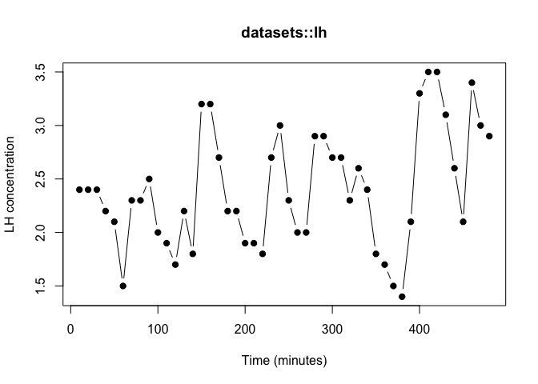
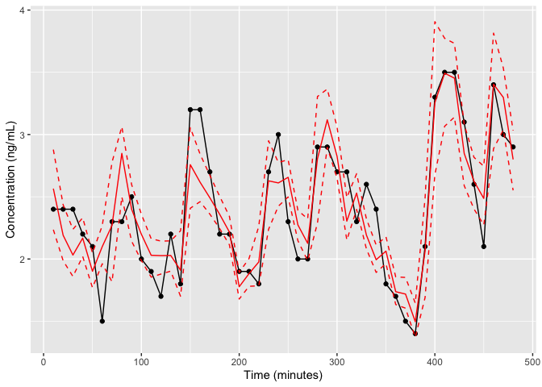
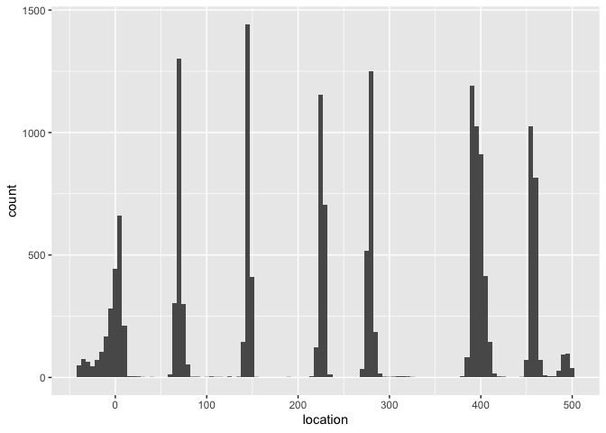

The other vignettes fit simulated series, where the truth is known. Here we turn
the model loose on real data. R ships with `lh` (in the **datasets** package):
luteinizing hormone measured in 48 blood samples taken at 10-minute intervals
from a human female, from Diggle (1990), *Time Series: A Biostatistical
Introduction*. LH is released from the pituitary in discrete pulses, so this
classic teaching series is a natural real-world test for the deconvolution model.

## The data

We reshape the built-in series into the `time`/`concentration` frame that
`fit_pulse()` expects. The samples are 10 minutes apart, so the 48 observations
span 480 minutes.


``` r
data(lh)                                         # base-R datasets::lh
lh_dat <- data.frame(time          = seq_along(lh) * 10,   # minutes
                     concentration = as.numeric(lh))
str(lh_dat)
#> 'data.frame':	48 obs. of  2 variables:
#>  $ time         : num  10 20 30 40 50 60 70 80 90 100 ...
#>  $ concentration: num  2.4 2.4 2.4 2.2 2.1 1.5 2.3 2.3 2.5 2 ...
plot(lh_dat$time, lh_dat$concentration, type = "b", pch = 19,
     xlab = "Time (minutes)", ylab = "LH concentration",
     main = "datasets::lh")
```



The series hovers around 2 with several clear excursions upward -- candidate
pulses for the model to recover.

## A specification for LH

We adapt the single-subject specification to this hormone and window: the
baseline prior sits near the observed troughs, the half-life prior is centred at
a physiologically reasonable 40 minutes, and we expect on the order of six pulses
across the 480-minute window. Real assay data is noisier than the simulations in
the other vignettes, so we give the error a slightly looser starting value.


``` r
spec <- pulse_spec(
  location_prior_type    = "strauss",
  prior_location_gamma   = 0.1,  prior_location_range = 30,
  prior_halflife_mean    = 40,   prior_halflife_var   = 1000,
  prior_sd_mass          = 0.5,  prior_sd_width       = 5,
  prior_mass_mean        = 2.5,  prior_mass_var       = 2,
  prior_mean_pulse_count = 6,    prior_width_mean     = 35,
  prior_baseline_mean    = 1.8,  prior_baseline_var   = 100,
  sv_mass_mean = 2, sv_width_sd = 10, sv_error_var = 0.01, sv_mass_sd = 0.4,
  sv_baseline_mean = 1.8, sv_halflife_mean = 42,
  pv_mean_pulse_width = 10, pv_indiv_pulse_width = 10, pv_sd_pulse_width = 0.1,
  pv_pulse_location = 5, pv_sd_pulse_mass = 0.45)
```

## Fit

We run a single production-length chain. (This chunk is precomputed offline via
`vignettes/precompute.R`, so the vignette itself builds quickly.)


``` r
set.seed(2026)
fit <- fit_pulse(data = lh_dat, spec = spec,
                 iters = 50000, thin = 20, burnin = 10000, verbose = FALSE)
#> Location prior is: strauss
#> mcmc iterations = 50000
#> thin = 20
#> burnin = 10000
```

## Does the model fit the data?


``` r
bp_predicted(fit, predict(fit, cred_interval = 0.9))
```



The fitted concentration (red) follows the observed series (black) through its
peaks and troughs, and the 90% credible band covers the data. The model
reproduces a real LH profile, not just simulated ones.

## What did it find?


``` r
pc <- patient_chain(fit)
round(colMeans(pc[, c("num_pulses", "baseline", "halflife",
                      "mass_mean", "width_mean")]), 2)
#> num_pulses   baseline   halflife  mass_mean width_mean 
#>       8.13       1.22      36.87       1.55      20.10
```


``` r
round(prop.table(table(pc$num_pulses)), 3)
#> 
#>     5     6     7     8     9    10 
#> 0.001 0.004 0.078 0.715 0.186 0.016
```


``` r
bp_location_posterior(fit)
```



The posterior favours roughly eight pulses, with a baseline near the observed
troughs and an elimination half-life around the high-30s of minutes -- both
physiologically sensible for LH. The location posterior places those pulses at
tight, well-separated positions that line up with the visible peaks in the
series; a couple sit at the edges of the window, which is the model's way of
accounting for secretion just before or after the sampling period.

## Caveats

This is a single chain shown for a quick demonstration. Before drawing firm
conclusions you should assess convergence properly -- run several chains and
check the effective sample size and the Gelman-Rubin statistic, as described in
the convergence-diagnostics vignette. The half-life, in particular, is the
slowest parameter to mix.
